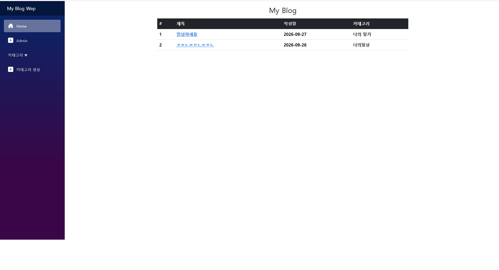
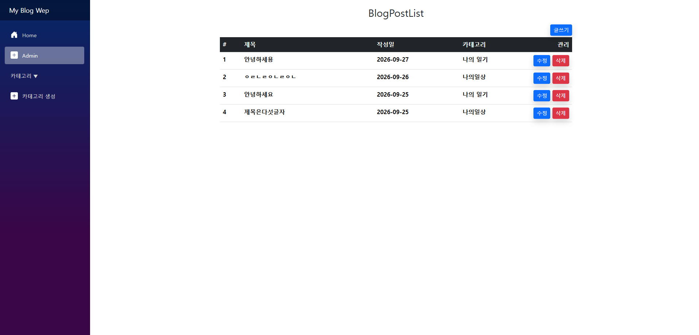
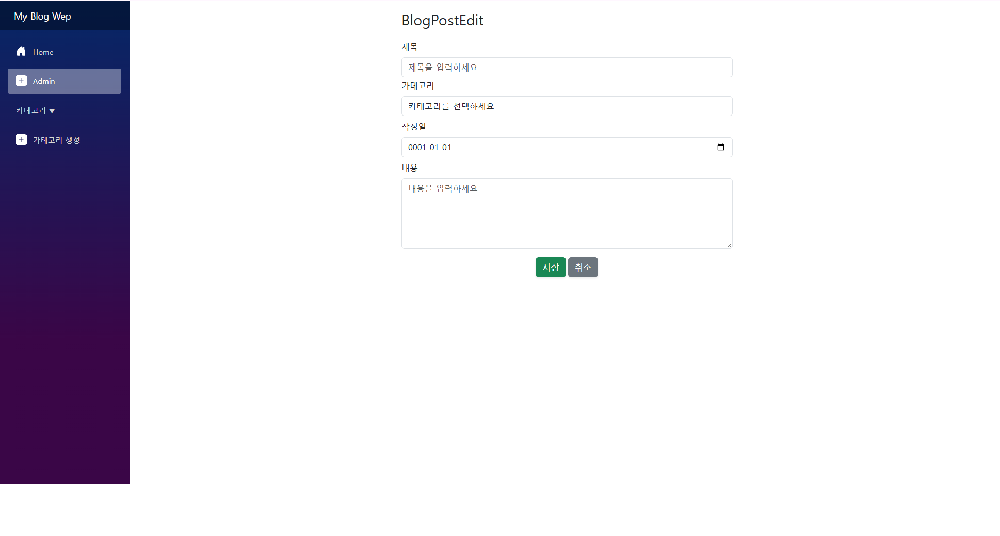
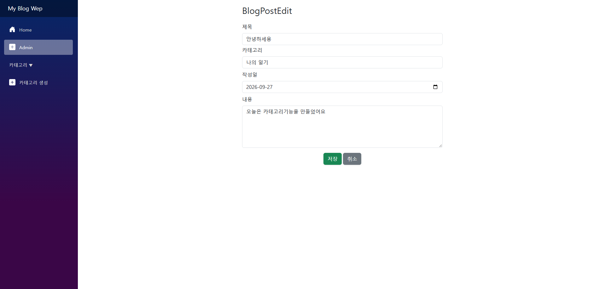
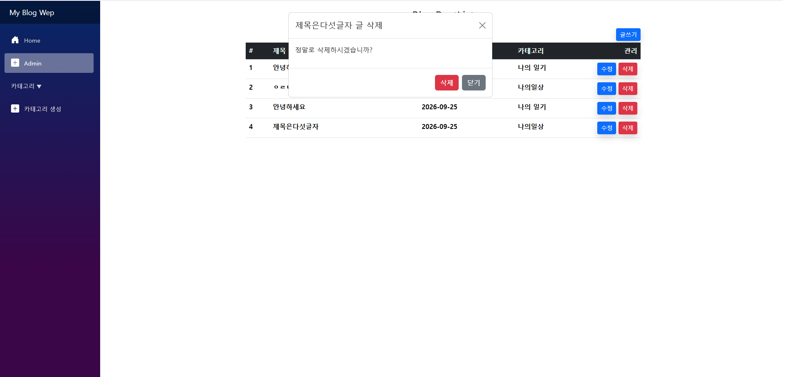
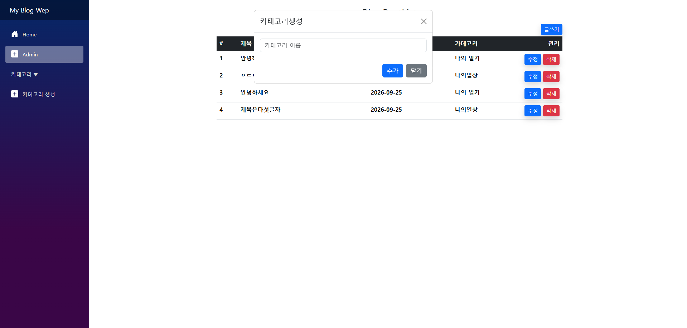
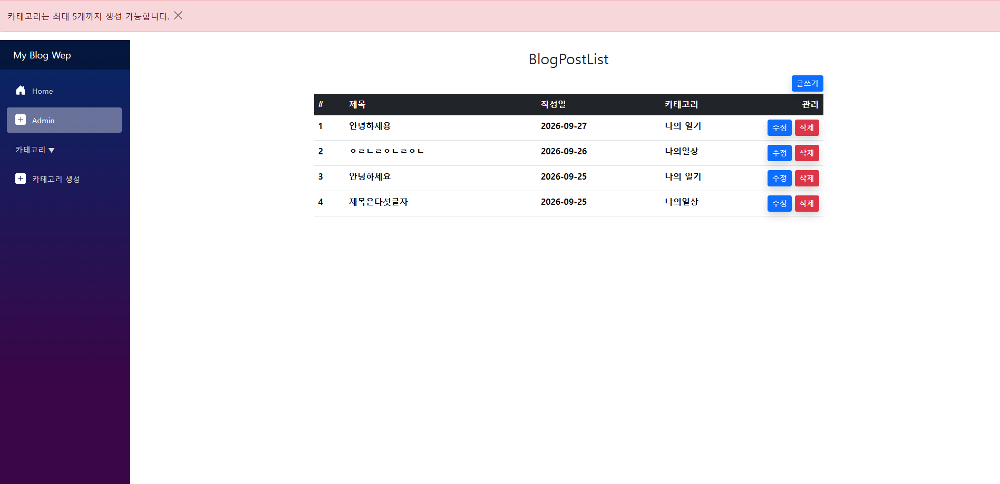
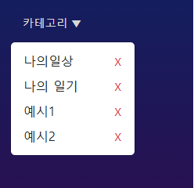
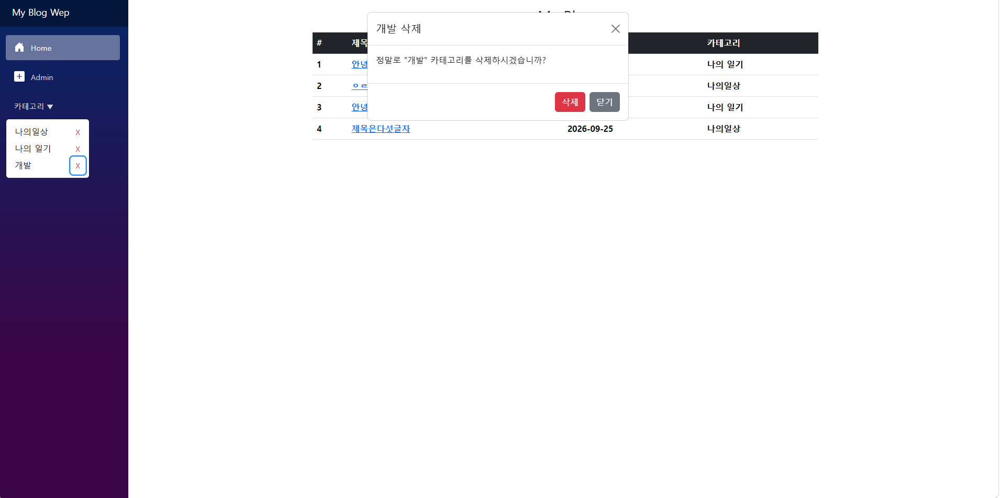
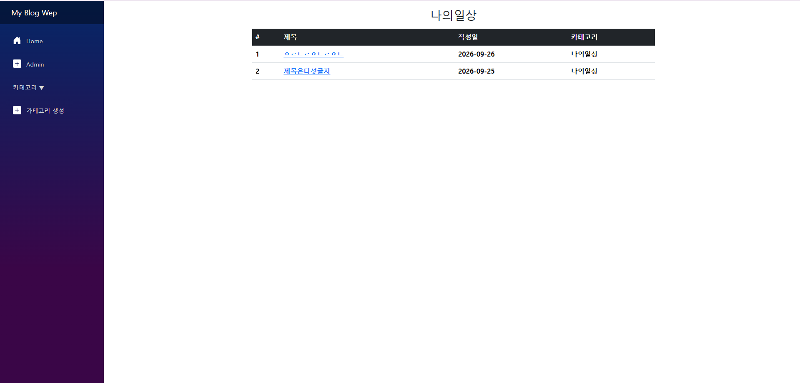

 
# 🔔 주제

 
<li>C# 블레이저 웹앱을 적극활용하여 자바스크립트사용없이 반응형 비동기 웹페이지 만들기</li>

  

# 📙 웹 소개
 
<h3>🔔 갤러리 🔔</h3>
  

 
<li>메인화면  
</li>   
 
 
  
<li>어드민페이지  
</li>   
 
 

<li>글작성  
</li>   
 
 

<li>글수정  
</li>   
 
 

<li>글삭제  
</li>   
 
 

<li>카테고리생성  
</li>   
 
 

<li>카테고리생성제한5개  
</li>   
 
 

<li>카테고리별페이지,카테고리삭제  
</li>   
<li>카테고리삭제확인모달  
</li>   
 
 

<li>카테고리페이지  
</li>   
 
 

  <h2 style="border-bottom: 1px solid #21262d; color: #c9d1d9;">Tech Stacks</h2>
   
    
    
    
    
    
    
    

